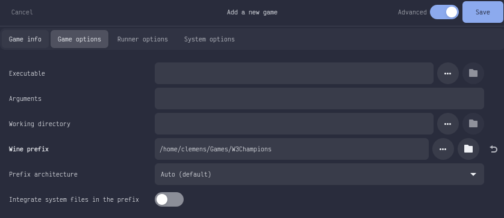
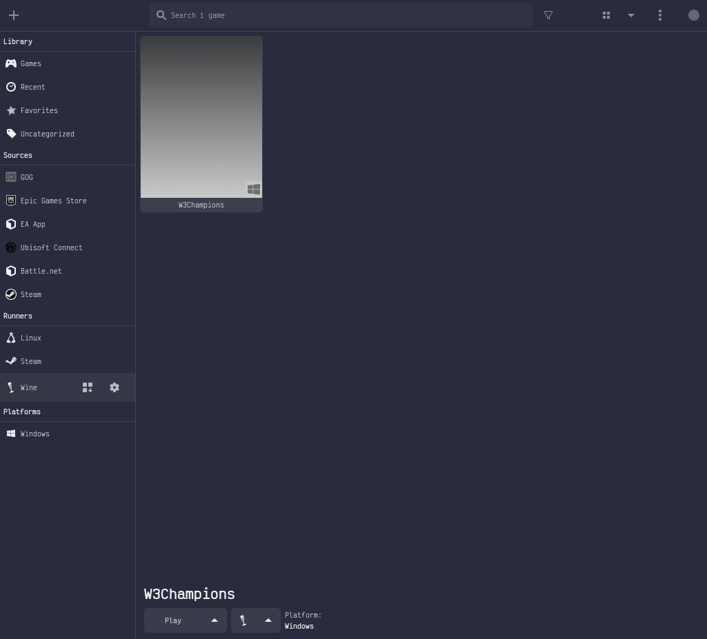

# Installing W3Champions on Linux

W3Champions, the competitive ladder and matchmaking platform for Warcraft III, is now working on Linux!
This guide will walk you through installing and running it on your system.

---

## Supported Systems

| Distribution | Compatibility          |
| ------------ | ---------------------- |
| Arch Linux   | ✅ Supported           |
| Nobara 41    | ⚠ Partially Supported |
| Other        | ❌ Not Confirmed       |

---

## Prerequisites

Before installing W3Champions, ensure you have the following:

- A valid **Warcraft III: Reforged** installation (through Battle.net).
- **Proton-GE (Latest, at least 9-26)** installed.
- **Lutris** for managing the installation.
- A **Vulkan-capable GPU**.
- The **latest Mesa drivers** installed.
- Follow **Lutris' instructions** for setting up drivers and Wine dependencies on Arch Linux.

---

## Arch Linux

First, enable multilib (32-bit support).

To enable the multilib repository, uncomment the `[multilib]` section in `/etc/pacman.conf`:

```
/etc/pacman.conf
--------------------------------------------------------------------------------------
[multilib]
Include = /etc/pacman.d/mirrorlist
```

Then upgrade the system:

```
sudo pacman -Syu
```

### AMD GPU Setup

To install support for the Vulkan API and 32-bit games, execute the following command:

```
sudo pacman -S --needed lib32-mesa vulkan-radeon lib32-vulkan-radeon \
    vulkan-icd-loader lib32-vulkan-icd-loader
```

### Installing wine

This may not be necessary, but we recommend to install wine according to the lutris documentation anyway.

```
sudo pacman -S wine-staging
```

Execute the following to install required dependencies:

```
sudo pacman -S --needed --asdeps giflib lib32-giflib gnutls lib32-gnutls \
    v4l-utils lib32-v4l-utils libpulse lib32-libpulse alsa-plugins lib32-alsa-plugins \
    alsa-lib lib32-alsa-lib sqlite lib32-sqlite libxcomposite lib32-libxcomposite \
    ocl-icd lib32-ocl-icd libva lib32-libva gtk3 lib32-gtk3 gst-plugins-base-libs \
    lib32-gst-plugins-base-libs vulkan-icd-loader lib32-vulkan-icd-loader \
    sdl2-compat lib32-sdl2-compat
```

> **Note:** This may seem like a lot of libraries, but they are essential for ensuring game compatibility.

---

## Other Distributions

If you use a different distribution and can make it work, please reach out!

---

## Installing Proton-GE (Latest) with ProtonPlus

To manage Proton and more, we recommend [ProtonPlus](https://github.com/Vysp3r/ProtonPlus)

    yay -S protonplus

Then run ProtonPlus and install the Latest available Proton-GE. You do not need anything else.

## Setting up Lutris

First install lutris.

    pacman -S lutris

Then start lutris and let it download its runtime and dependencies.
By default, lutris will download and use wine-ge-8-26.
This version however does _NOT_ work for W3Champions!
You will not be able to install the required WebView2 runtime using that wine version.

> [!CAUTION]
> After lutris downloaded `wine-ge-8-26`, it will set that wine version as the default runner for all wine builds.
> Make sure that, after that downloaded, you change the runner from `wine-ge-8-26` back to `Proton-GE (Latest)`!
> Forgetting to do so may require starting the whole installation process from scratch in a fresh wine prefix.

In lutris, select the Wine runner on the left side.


Then change the runner to Proton-GE (Latest)


You do not have to change any other runner options and can leave the default values.

You do however have to edit the system options.
Select the system options, toggle the `Advanced` switch, scroll down and add an environment variable.


## Lutris installation

The following steps are automated using the `w3c.yaml` [script](./w3c.yaml).
The script may work, however it tends to get stuck waiting for lingering processes to finish.
For that reason, I will demonstrate the manual method.

### Creating a Lutris Game

First, we create a simple lutris game, without any configuration yet.

Press the plus button in the upper left corner, then select `Add locally installed game`.


Set any name for the game, we will use `W3Champions`. Select the wine runner for the game.


Then in the game options, select the wineprefix. We will use `~/Games/W3Champions`.



And click Save.

It should create the game as follows.



Clicking on the game once, we can select to run an EXE inside that prefix.
We will use this function to install three different installers. First, we install the WebView2 runtime.

## Useful Links

- [Official W3Champions Website](https://www.w3champions.com)
- [Lutris](https://lutris.net)
- [WineHQ](https://www.winehq.org)
- [W3Champions Discord](https://discord.gg/uJmQxG2)

Happy ladder climbing! 🎮
